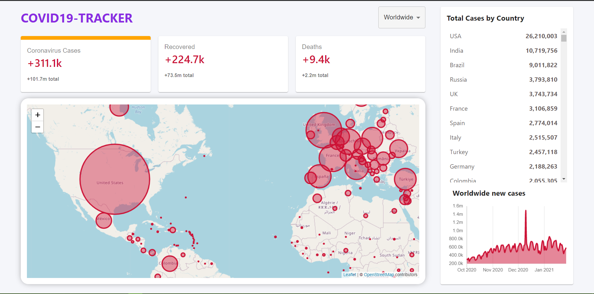

# Getting Started with Create React App

This project was bootstrapped with [Create React App](https://github.com/facebook/create-react-app).

# Covid19-tracker 
> Web Application built with React.js,chart.js,leaflet.js and Material UI.

> Deployed on Firebase.

>  Check it out : [Covid-tracker](covid19-tracker-f436a.firebaseapp.com)

