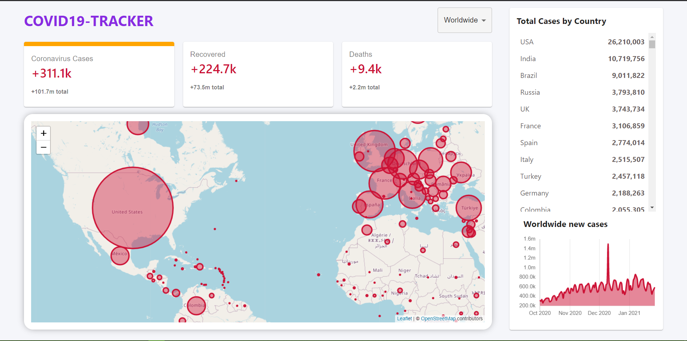

# Getting Started with Create React App

This project was bootstrapped with [Create React App](https://github.com/facebook/create-react-app).

# Covid19-tracker

 Web Application built with React.js,chart.js,leaflet.js and Material UI.

COVID-19 is the infectious disease caused by the most recently discovered coronavirus. This new virus and disease were unknown before the outbreak began in Wuhan, China, in December 2019.

With the oubreak world-wide and increasing number of active patients, there are many efforts to project the data in some form for people to follow and understand.

`COVID19-tracker` is yet another Project to build a Dashboard like app to showcase the data related to the COVID-19(Corona Virus).

 `COVID19-tracker` app is running as a website hosted on Firebase.
# See it Running 
👉 [Covid-tracker](covid19-tracker-f436a.firebaseapp.com)

# Analytics

`COVID19-tracker` provides some basic but useful analytics to understand the depth and gravity of the situation.

## Home Page [🔗](covid19-tracker-f436a.firebaseapp.com)

`Home` page provides the statistics on the data from all over the world.

- Total Number of Confirmed Cases
- Total Number of Active Cases
- Total Number of Recoverd Cases
- Total Number of Deaths
- Total cases By Country
- World Map showing the Cases of each Country in a circular representation
- Representing WorldWide new cases,Recoverd and Deaths in chart
